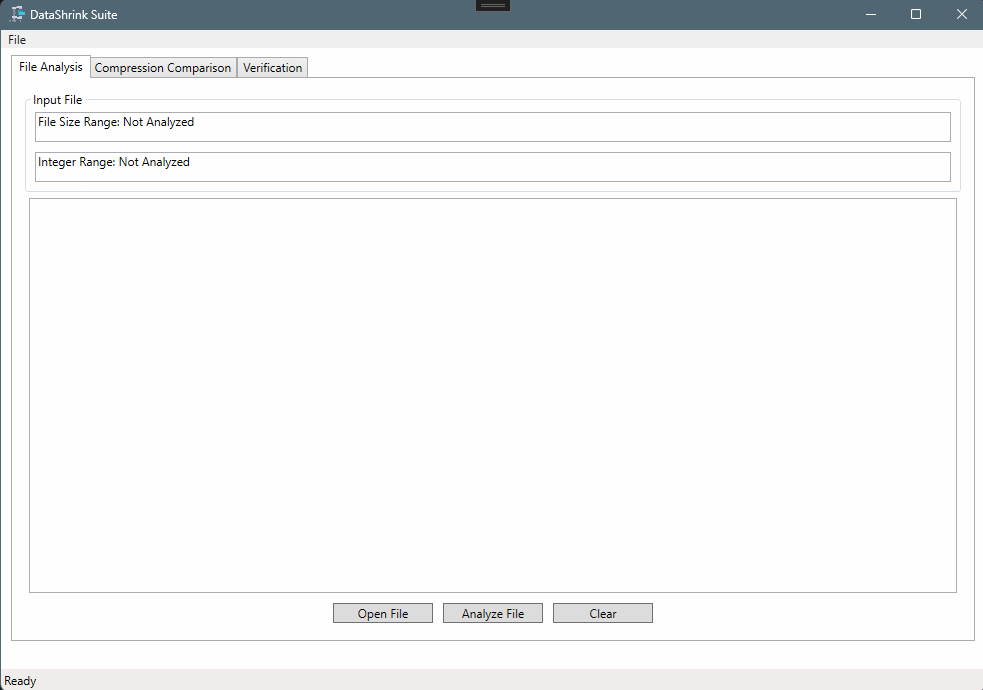
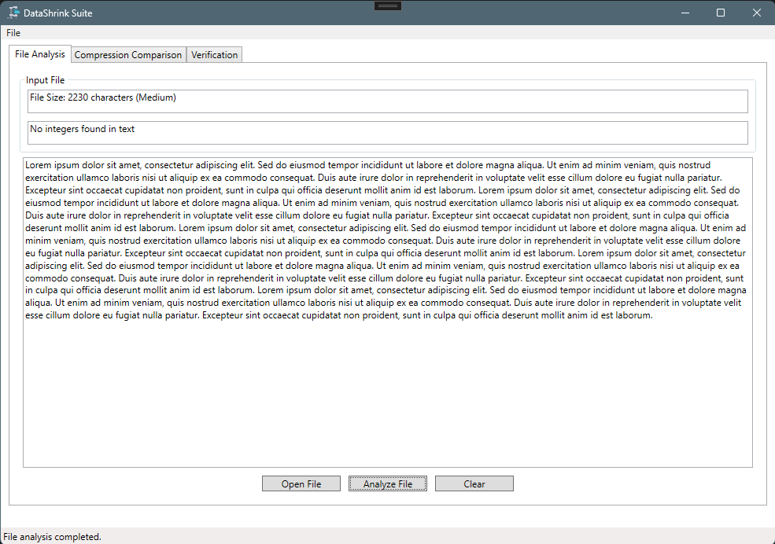
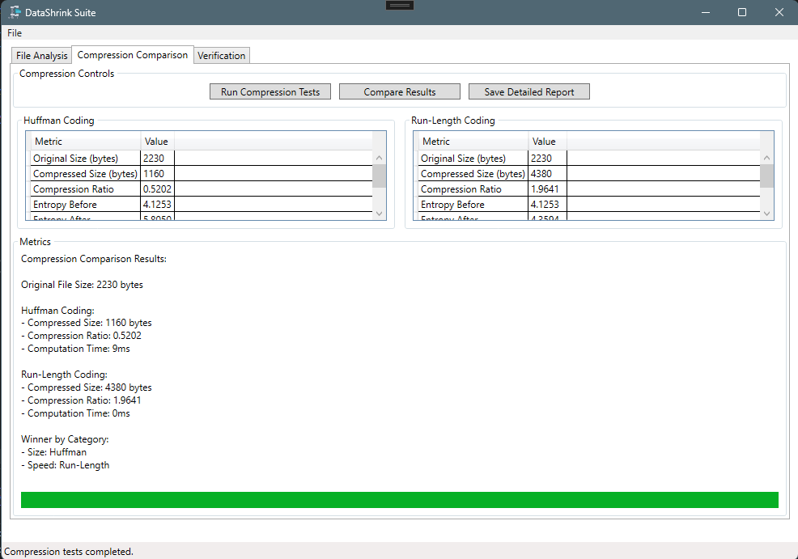
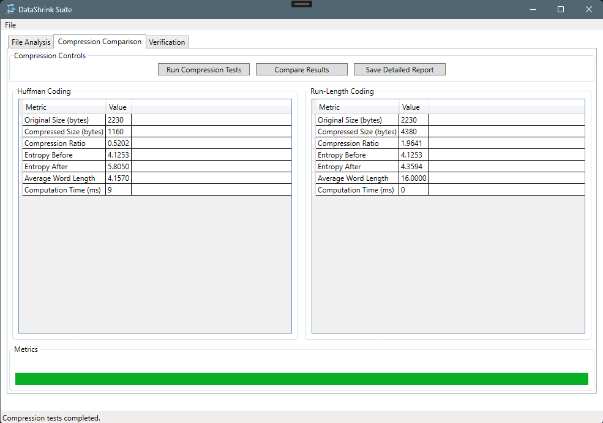
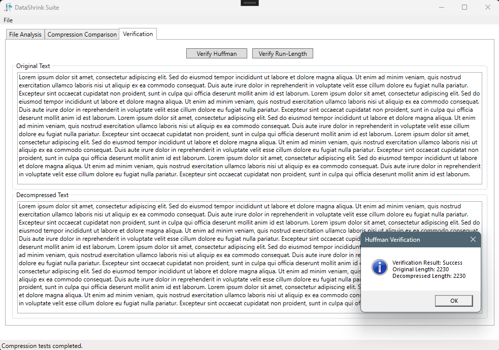
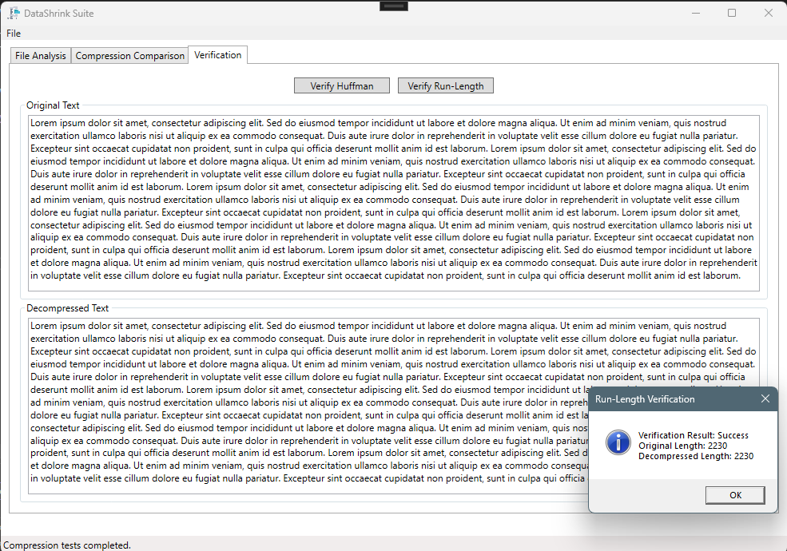
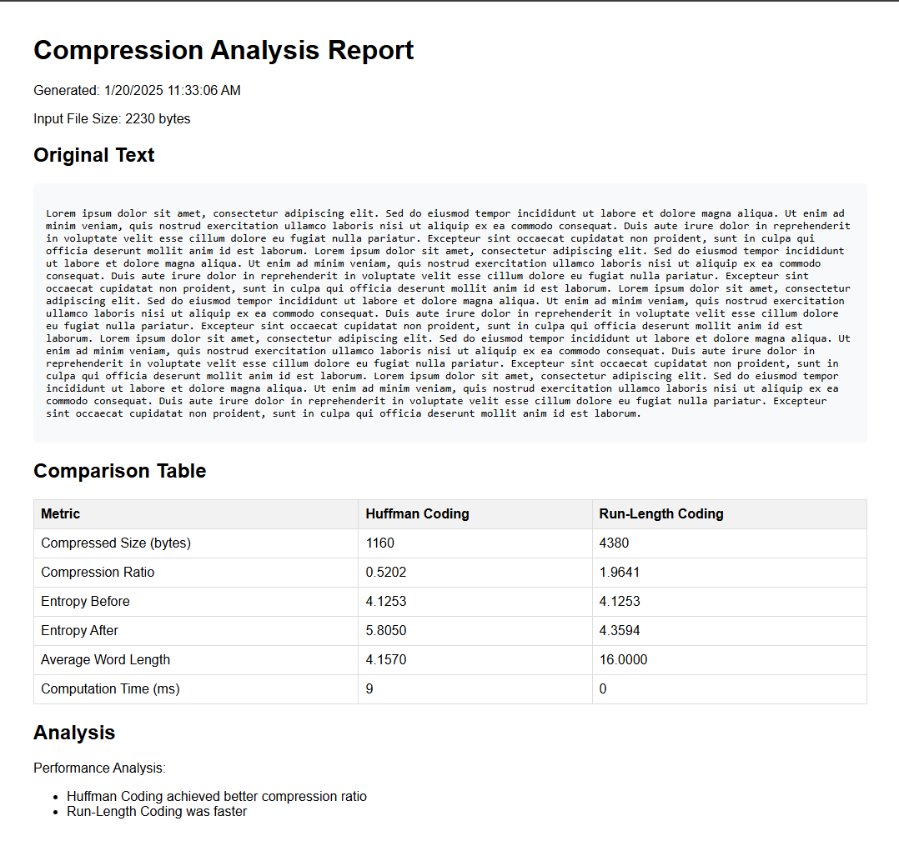

# DataShrink

## Overview
DataShrink is a sophisticated Windows desktop application that implements and compares two fundamental text compression algorithms: Huffman Coding and Run-Length Encoding (RLE). Designed with both functionality and user experience in mind, DataShrink provides a comprehensive interface for analyzing and comparing compression techniques across various file sizes.

## Application Screenshots

### Main Interface


### Analysis Features




### Verification



### Reporting


## Key Features

### Compression Algorithms
- **Huffman Coding**
  - Dynamic Huffman tree construction
  - Optimal prefix coding
  - Entropy-based compression
  
- **Run-Length Encoding (RLE)**
  - Efficient repetition encoding
  - Byte-level compression
  - Optimized for repeating sequences

### Analysis Capabilities
- **Multi-size File Support**
  - Small files (500-1000 characters)
  - Medium files (2000-5000 characters)
  - Large files (10000+ characters)

- **Performance Metrics**
  - Compression ratios
  - Processing time measurement
  - Memory usage analysis
  - Entropy calculations
  - Average word length computation

### Reporting Features
- **Detailed Analysis Reports**
  - Comprehensive performance comparisons
  - Statistical analysis
  - Visual data representation
  - File size categorization results

## System Requirements
- Windows 10 or later
- .NET 6.0 Runtime
- Minimum 4GB RAM
- 100MB free disk space

## Installation Guide
1. Download the latest release from [Releases](https://github.com/TheAnalystAbdalrahman/DataShrink/releases)
2. Extract the zip file to your preferred location
3. Run DataShrink.exe

## User Guide

### Basic Operation
1. Launch DataShrink
2. Click "Open File" to load your text file
3. Select compression algorithm (Huffman or RLE)
4. Click "Compress" to start the process
5. View detailed analysis results
6. Save or export reports as needed

### File Size Testing
- Use files within these ranges for optimal testing:
  ```
  Small: 500-1000 characters
  Medium: 2000-5000 characters
  Large: 10000+ characters
  ```

## Development Setup

### Prerequisites
- Visual Studio 2022
- .NET 6.0 SDK
- Git

### Building from Source
1. Clone the repository
   ```bash
   git clone https://github.com/TheAnalystAbdalrahman/DataShrink.git
   ```
2. Open `DataShrink.sln` in Visual Studio
3. Restore NuGet packages
4. Build the solution
5. Run the application

## Project Structure
```
DataShrink/
├── MainWindow.xaml        # Main UI definition
├── MainWindow.xaml.cs     # Main UI logic
├── HuffmanCoding.cs      # Huffman algorithm implementation
├── RunLengthEncoding.cs  # RLE algorithm implementation
└── Properties/           # Application properties
```

## Contributing
1. Fork the repository
2. Create your feature branch (`git checkout -b feature/AmazingFeature`)
3. Commit your changes (`git commit -m 'Add some AmazingFeature'`)
4. Push to the branch (`git push origin feature/AmazingFeature`)
5. Open a Pull Request

## Academic Context
This project is developed as part of a software engineering course assignment, focusing on:
- Implementation of compression algorithms
- GUI development
- Performance analysis
- File processing
- Data visualization

## Author
**Abdalrahman**
- GitHub: [@TheAnalystAbdalrahman](https://github.com/TheAnalystAbdalrahman)


## Repository
[https://github.com/TheAnalystAbdalrahman/DataShrink](https://github.com/TheAnalystAbdalrahman/DataShrink)
